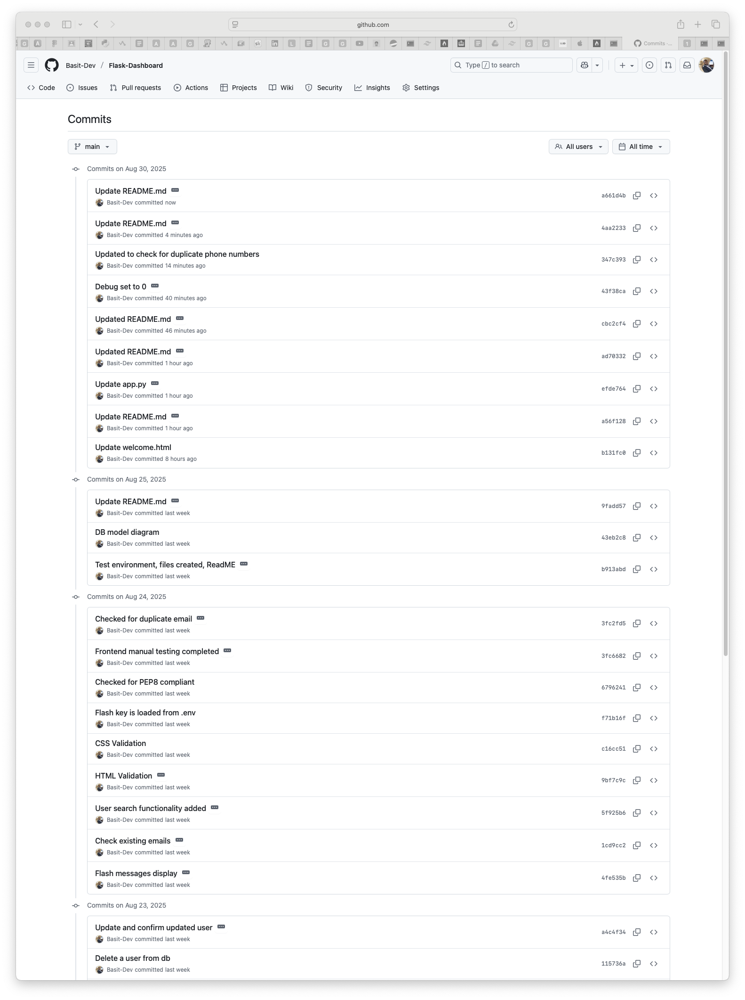

# Flask-Dashboard
A Flask-based user dashboard with PostgreSQL, HTML, and TailwindCSS. A user registration with full CRUD operations (add, edit, delete). Provides a responsive interface with a clean design, and PostgreSQL integration for managing users efficiently.

---

## What This Project Is

This application lets you:
- **View a directory of users** in a clean, tabular layout  
- **Add new users** with details such as name, email, phone, and department  
- **Edit existing users** to update their information  
- **Delete users** from the system when no longer needed  

I built it to practice creating a full-stack web application with Flask, PostgreSQL, and TailwindCSS. It’s designed to be simple, responsive, and easy to extend, working smoothly across desktop and mobile devices.

---

## User Stories
- **As an administrator**, I want to view a dashboard of all users so that I can manage accounts.  
- **As an administrator**, I want to add new users so that I can grow the user base.  
- **As an administrator**, I want to edit user information so that I can keep records accurate.  
- **As an administrator**, I want to delete users so that I can remove inactive or invalid accounts.

---

## Tech Stack
- Flask (Python)  
- PostgreSQL  
- HTML + TailwindCSS  
- Jinja2 Templates  

## What the Website Looks Like & Functionality Overview

The dashboard has a clean and minimal design with a focus on usability:

- **Navigation Bar**:  
  Positioned at the top with the project name on the left and quick actions (`View Users` and `Add User`) on the right.  
  The bar uses a light grey background with subtle separation from the main content.

- **Page Title**:  
  A bold, blue "User Directory" heading introduces the main section.

- **User Table**:  
  - Displays users in a tabular format with columns for Name, Email, Phone, Department, and Actions.  
  - The table header has a solid blue background with white text for contrast.  
  - Rows with a light background for readability seperated by a light grey line.  
  - Emails are styled as blue links.  
  - Actions include **Edit** (blue) and **Delete** (red) for clear visual cues.

- **Buttons**:  
  The primary "Add User" button uses a solid blue background with white text to stand out as the main call-to-action.

- **Layout**:  
  The overall layout is centered, responsive, and styled with TailwindCSS, giving it a modern web application feel.

### Works on Any Device
- Whether you’re on your phone or laptop, the layout adjusts to fit your screen, mobile devices use a hamburger menu implenented using JavaScript.

---

## How It Works

The User Directory App follows a straightforward flow:

1. **Home Page**  
   Users land on a welcome screen that explains the app and provides a button to view the user list.

2. **User Directory**  
   Displays all registered users in a table with columns for name, email, phone, department, and actions.

3. **Add User**  
   Clicking **Add User** opens a form where new user details can be entered and stored in the PostgreSQL database.

4. **Edit User**  
   Each user row includes an **Edit** action, allowing updates to user information through a form.

5. **Delete User**  
   The **Delete** action removes a user record from the database.

6. **Database Integration**  
   All data is persisted in PostgreSQL. Flask handles routing and logic, while Jinja2 templates and TailwindCSS style the front end.

7. **Responsive UI**  
   The interface is styled to be clean, modern, and responsive, making it usable across devices.

In short, the app provides a lightweight, for managing a list of users with full CRUD functionality.

---

## Figma Files

<p align="center">
  <strong>Colour Pallette</strong><br>
  
</p>

<p align="center">
  <strong>Desktop Home</strong><br>
  
</p>

<p align="center">
  <strong>Desktop Users</strong><br>
  
</p>

<p align="center">
  <strong>Desktop Update User</strong><br>
  
</p>

<p align="center">
  <strong>Desktop Add User</strong><br>
  
</p>

<p align="center">
  <strong>Desktop Add User Confirm</strong><br>
  
</p>

<p align="center">
  <strong>Desktop Delete User</strong><br>
  
</p>

<p align="center">
  <strong>Mobile User</strong><br>
  
</p>

<p align="center">
  <strong>Mobile Delete</strong><br>
  
</p>

<p align="center">
  <strong>Mobile Add User Confirm</strong><br>
  
</p>

<p align="center">
  <strong>Desktop Home</strong><br>
  
</p>

<p align="center">
  <strong>Desktop Users</strong><br>
  
</p>

<p align="center">
  <strong>Desktop Update User</strong><br>
  
</p>

<p align="center">
  <strong>Desktop Add User</strong><br>
  
</p>

<p align="center">
  <strong>Desktop Add User Confirm</strong><br>
  
</p>

<p align="center">
  <strong>Desktop Delete User</strong><br>
  
</p>

<p align="center">
  <strong>Mobile User</strong><br>
  
</p>

<p align="center">
  <strong>Mobile Delete</strong><br>
  
</p>

<p align="center">
  <strong>Mobile Add User Confirm</strong><br>
  
</p>

---

## Credits and Acknowledge
- Flash messages credits to StackOverflow.
- pytest Docs.
- pyBites.
- YouTube -> Corey Schafer, ArjanCodes for Python testing.

---

## Screenshots of validation

<p align="center">
  <strong>welcome.html</strong><br>
  
</p>

<p align="center">
  <strong>users.html</strong><br>
  
</p>

<p align="center">
  <strong>update_user.html</strong><br>
  
</p>

<p align="center">
  <strong>delete_user.html</strong><br>
  
</p>

<p align="center">
  <strong>confirm_update.html</strong><br>
  
</p>

<p align="center">
  <strong>add_user.html</strong><br>
  
</p>

<p align="center">
  <strong>CSS</strong><br>
  
</p>

---

# Frontend Manual Testing

## What Are We Testing?
We want to make sure the app looks, works and responds when you click buttons, fill out forms, search for users and CRUD operations display the correct results.

Pages to check:
- **Welcome page** (`/`)
- **User list** (`/users`)
- **Add user** form (`/add`)
- **Update user** form (`/update/<id>`)
- **Confirm update** (`/update/confirm/<id>`)
- **Delete user** confirmation (`/delete/<id>`)

---

## Test Implementation Requirements
- Browser: Chrome, Firefox, Safari, or Edge.
- Will run on (`http://localhost:5000`).
- Some fake data like:  
  - Alice Brown, `alice@example.com`, `07123456789`, Sales  
  - Bob Chen, `bob@example.com`, `07987654321`, Support  

---

## Step 1: Check General Stuff

- Page load without errors.
- Layout neat and not broken.
- buttons and links work when clicked.
- On phone or tablet, it resize nicely without weird scroll bars.

---

## Step 2: Welcome Page (`/`)

- Page loads as intended.
- Buttons take you to the user list page.

---

## Step 3: User List (`/users`)

- If there are no users, a message - "No users found" displays.
- Search by name, email, phone, department - displays correct results.
- When something random is typed - "No users found".
- After searching, “Show all” button displays and when clicked displays all users.
- Update and delete buttons navigate tpo the correct pages.

---

## Step 4: Add User (`/add`)

- Checked if input fileds are blank and click submit - Error displays.
- When invalid email typed - Shows error.
- Once a user user is added - it takes you back to the user list with a success message.
- When an email is the same - a “duplicate email” error displays.

---

## Step 5: Update User (`/update/<id>`)

- Form shows the correct id for the user.
- After changing details and updated - “User updated successfully” displays.
- When changing the email to one that already exists - Error displays.
- If the email is a duplicate regardless of case sensitive - Error displays.
- After clicking cancel - it takes you back to the user list.

---

## Step 6: Confirm Update (`/update/confirm/<id>`)

- It shows the new details before updating.
- After click confirm - it saves the changes.
- If you click cancel - it takes you back without updating.

---

## Step 7: Delete User (`/delete/<id>`)

- It asks “Are you sure?” before deleting.
- Cancel - User is still in the list.
- Once clicked delete - User is removed from the list.

---

## Step 8: Messages & Alerts

- When things work, green "Success" messages display.
- When there’s an error (like duplicate email), a red "Error" message displays.
- Messages go away automatically, when X clicked or when user refreshes the screen.

---

## Step 9: Mobile View

- Navbar, forms, and tables look as intended.
- You scroll easily without breaking the layout.

---

## Step 10: Quick Test

After making changes, quickly check:
- [x] Add a user - works.
- [x] Search users - works.
- [x] Update user - works.
- [X] Delete user - works.
- [x] Layout on mobile - works.

---

## BackEnd Automated Testing

### What We Tested

|------------------|--------------------------------------------------|------------------------------------------------------------------|
| Category         | Test Name                                        | What It Checks                                                   |
|------------------|--------------------------------------------------|------------------------------------------------------------------|
| **Page Load**    | `test_home_200`                                  | Homepage (`/`) loads successfully                                |
|                  | `test_users_page_200`                            | Users page loads and users appear                                |
|                  | `test_users_search_query`                        | Search filters users correctly                                   |
| **Add User**     | `test_add_user_get_form`                         | Add user form page loads                                         |
|                  | `test_add_user_post_success`                     | New user can be added successfully                               |
|                  | `test_add_user_duplicate_email_shows_error`      | Duplicate emails are blocked                                     |
|                  | `test_add_user_duplicate_email_case_insensitive` | Duplicate email checks case-insensitively                        |
| **Update User**  | `test_update_user_get_form`                      | Update form page loads correctly                                 |
|                  | `test_update_user_post_success`                  | User details can be updated successfully                         |
|                  | `test_update_user_duplicate_email_blocked`       | Updating to existing email is blocked                            |
| **Delete User**  | `test_delete_user_flow`                          | User can be created and then deleted successfully                |
|------------------|--------------------------------------------------|------------------------------------------------------------------|

###  How to Run Tests

Run the tests with: pytest -vs

### Test Results Outcome

<p align="center">
  <strong>Test Results</strong><br>
  
</p>

---

## Databse Model Diagram

<p align="center">
  <strong>DB Model</strong><br>
  
</p>

---

# Flask App Deployment on AWS EC2 (Ubuntu)

This guide shows the full process to set up and deploy a Flask app on **AWS EC2 Ubuntu** using **PostgreSQL**, **Gunicorn**, **Nginx**.

---

## **1. Launch EC2 Instance**

- Choose **Ubuntu 22.04/24.04**  
- In **Security Group**:  
  - Allow **SSH (22)** → from your IP  
  - Allow **HTTP (80)** → from anywhere (0.0.0.0/0)  
  - Allow **HTTPS (443)** → if you want SSL  

---

## **2. Install Required Packages**
```bash
sudo apt update && sudo apt upgrade -y
sudo apt install -y python3 python3-venv python3-dev python3-pip   libpq-dev postgresql postgresql-contrib nginx curl git
```

---

## **3. Set Up PostgreSQL**
```bash
sudo -u postgres psql
```
Inside the `psql` shell:
```sql
CREATE DATABASE flask_app_db;
CREATE USER flask_user WITH PASSWORD 'yourpassword';
GRANT ALL PRIVILEGES ON DATABASE flask_app_db TO flask_user;
\q
```

---

## **3. Create PostgreSQL Tables**
Inside the `psql` shell:
```sql
CREATE TABLE IF NOT EXISTS users (
  id SERIAL PRIMARY KEY,
  name VARCHAR(100),
  email VARCHAR(100) UNIQUE NOT NULL,
  phone VARCHAR(20),
  department VARCHAR(100)
);
---

## **4. Deploy Your Flask App**
Clone your repo:
```bash
cd /var/www
sudo git clone https://github.com/Basit-Dev/Flask-Dashboard.git .
sudo chown -R ubuntu:www-data myapp
cd myapp
```

Create virtual environment:
```bash
python3 -m venv venv
source venv/bin/activate
pip install --upgrade pip wheel
pip install -r requirements.txt
```

---

## **5. Configure Environment Variables**
Create `.env` file:
```bash
DB_USER=myuser
DB_PASSWORD=mypassword
DB_HOST=localhost
DB_NAME=mydatabase
FLASH_SECRET_KEY=mysecretkey
```

Load in `app.py`:
```python
from dotenv import load_dotenv
load_dotenv()
```

---

## **6. Test Gunicorn**
Run:
```bash
gunicorn -b 0.0.0.0:8000 app:app
```
Test in browser:  
`http://13.62.20.58/`

---

## **7. Create Systemd Service for Gunicorn**
Create service file:
```bash
sudo nano /etc/systemd/system/myapp.service
```

Paste:
```ini
[Unit]
Description=Gunicorn instance for Flask app
After=network.target

[Service]
User=ubuntu
Group=www-data
WorkingDirectory=/var/www/myapp
Environment="PATH=/var/www/myapp/venv/bin"
ExecStart=/var/www/myapp/venv/bin/gunicorn --workers 3 --bind 127.0.0.1:8000 app:app

Restart=always
RestartSec=3
RuntimeDirectory=gunicorn

[Install]
WantedBy=multi-user.target
```

Enable & start:
```bash
sudo systemctl daemon-reload
sudo systemctl daemon-reload
sudo systemctl enable myapp
sudo systemctl start myapp
```

---

## **8. Configure Nginx**
Create site config:
```bash
sudo nano /etc/nginx/sites-available/myapp
```bash

Paste:
```nginx
server {
    listen 80;
    server_name _;

    location / {
        proxy_pass http://127.0.0.1:8000;
        proxy_set_header Host $host;
        proxy_set_header X-Real-IP $remote_addr;
        proxy_set_header X-Forwarded-For $proxy_add_x_forwarded_for;
        proxy_set_header X-Forwarded-Proto $scheme;
    }

    location /static/ {
        alias /var/www/myapp/static/;
    }
}
```

Enable site:
```bash
sudo ln -s /etc/nginx/sites-available/myapp /etc/nginx/sites-enabled/
sudo rm -f /etc/nginx/sites-enabled/default
sudo nginx -t
sudo systemctl reload nginx
```

---

## **11. Testing & Logs**
Check Gunicorn logs:
```bash
journalctl -u myapp -f
```

Check Nginx config:
```bash
sudo nginx -t
sudo systemctl reload nginx
```

---

## Making the Flask App Publicly Available and Always Running

we configured AWS EC2, Nginx, and Gunicorn so the Flask app is accessible from anywhere and runs automatically on boot or after crashes.

## 1. Open AWS Security Group
1. Go to AWS Console → EC2 → Security Groups
2. Select the security group for your EC2 instance  
3. Under nbound Rules - Edit, add:  
   - HTTP, TCP, 80, Source: `0.0.0.0/0` (IPv4)  
4. Save changes  

This allows all incoming web traffic on port 80.


## 2. Configure Nginx for Public Access 
Edit the Nginx site config:
```bash
sudo nano /etc/nginx/sites-available/myapp
```

----

## Run the App Locally (Development Setup)

This guide explains how to set up and run the Flask app on your local machine for development.

### 1. Prerequisites
Make sure you have the following installed:
- Python **3.10+**
- Git
- One of:
  - **PostgreSQL**

### 2. Clone the Repository
```bash
git clone https://github.com/Basit-Dev/Flask-Dashboard.git
cd Flask-Dashboard
```

### 3. Create a Virtual Environment
**macOS/Linux**:
```bash
python3 -m venv .venv
source .venv/bin/activate
```

Install dependencies:
```bash
pip install -r requirements.txt
```

### 4. Configure Environment Variables
Create a `.env` file in the project root:

**Option A: PostgreSQL**
```env
DB_USER=myuser
DB_PASSWORD=mypassword
DB_HOST=localhost
DB_NAME=mydatabase

FLASK_ENV=development
FLASH_SECRET_KEY=mysecretkey
DATABASE_URL=postgresql://postgres:<password>@localhost/<mydatabase>
TEST_DATABASE_URL=sqlite:///:memory:
```

### 5. (PostgreSQL Only) Create the Database
```bash
createdb flask_app_db
```

### 6. Initialize Tables
```bash
python -c "from app import db; db.create_all();"
```

### 7. Run the App
Flask Development Server:
```bash
python app.py
```
```bash
Visit: http://127.0.0.1:5000
```

---

## Fetch Changes From GitGub Repo

 - Follow the steps:
```bash
cd /var/www/myapp
source venv/bin/activate
git fetch origin
sudo systemctl restart myapp
sudo systemctl status myapp
sudo nginx -t
sudo systemctl reload nginx
```

---

## Screenshots of Git Commits

<p align="center">
  <strong>Screenshot 1</strong><br>
  
</p>

<p align="center">
  <strong>Screenshot 2</strong><br>
  
</p>

<p align="center">
  <strong>Screenshot 3</strong><br>
  
</p>

---